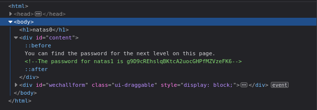

# Level 0

### Login
`url`: http://natas0.natas.labs.overthewire.org \
`username`: natas0 \
`password`: natas0 

### Solution

The initial level is quite straightforward. The password for the subsequent level is stored in plaintext within the page's HTML:

