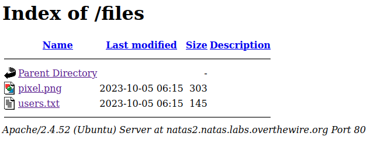

# Level 2

### Login
`url`: http://natas2.natas.labs.overthewire.org
`username`: natas2
`password`: h4ubbcXrWqsTo7GGnnUMLppXbOogfBZ7

### Solution

With these early levels, inspecting the HTML can help us understand what the web application is doing. In this level, if you inspect the HTML you will notice an image is being loaded from `files/pixel.png`. So what happens if we try to access the `file` directory with this URL `http://natas2.natas.labs.overthewire.org/files`?



Look at that! We have a file called `users.txt` that contains the password to the next level:

```text
# username:password
alice:BYNdCesZqW
bob:jw2ueICLvT
charlie:G5vCxkVV3m
natas3:G6ctbMJ5Nb4cbFwhpMPSvxGHhQ7I6W8Q
eve:zo4mJWyNj2
mallory:9urtcpzBmH
```