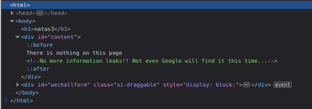
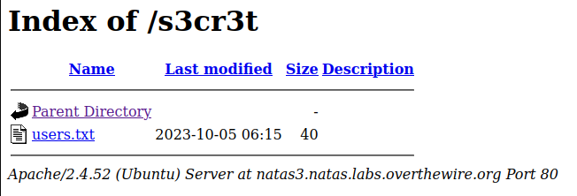

# Level 3

### Login
`url`: http://natas3.natas.labs.overthewire.org \
`username`: natas3 \
`password`: G6ctbMJ5Nb4cbFwhpMPSvxGHhQ7I6W8Q

### Solution
Like the previous levels, its a good idea to check the source HTML for any secrets or possible hints:



There seem to be no secrets, but a remarkable clue is present! This clue likely pertains to Google's crawlers. Google, alongside various other companies, utilizes bots to scour the web. The reputable bots, upon visiting a site, initially scan the `/robots.txt` file and comply with any specified rules within. Let's explore the contents of this file by visiting `http://natas3.natas.labs.overthewire.org/robots.txt`:

```text
User-agent: *
Disallow: /s3cr3t/
```

It appears that `robots.txt` has a rule that tells crawlers to ignore the `/s3cr3t` page. Lets visit this page to see what we find:



If we take a look at `users.txt`, you will notice it holds the password to the next level:

```text
natas4:tKOcJIbzM4lTs8hbCmzn5Zr4434fGZQm
```